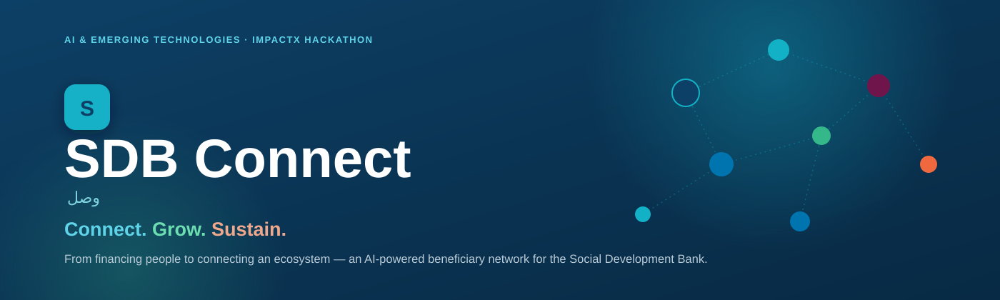
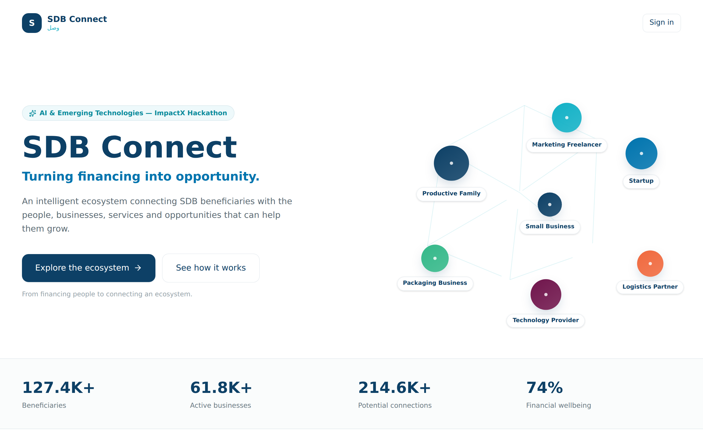
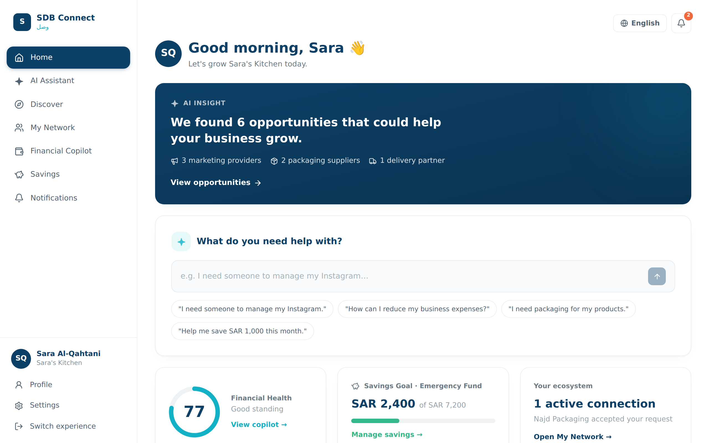
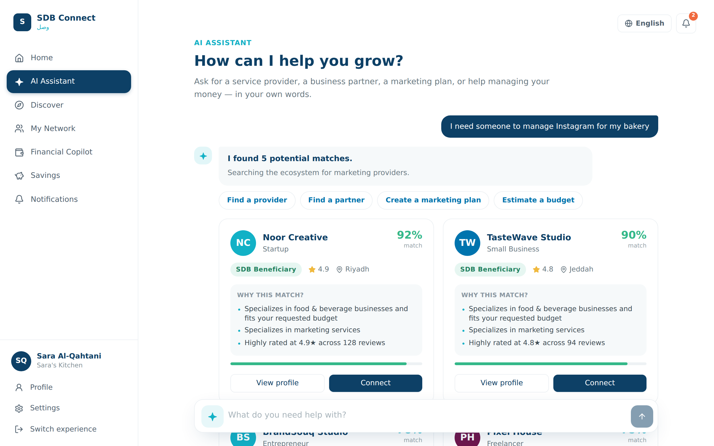
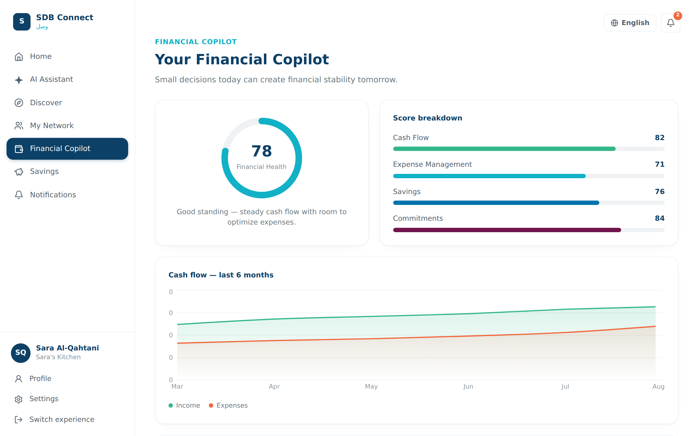
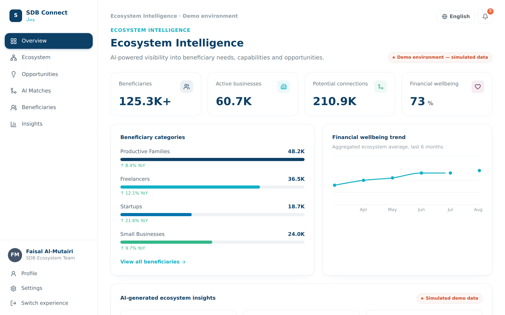
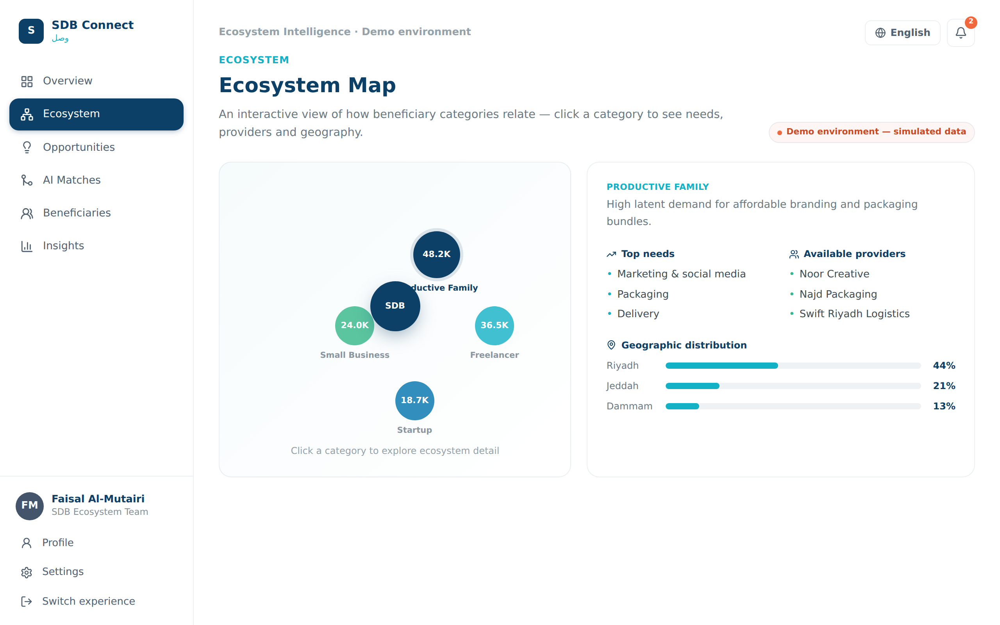
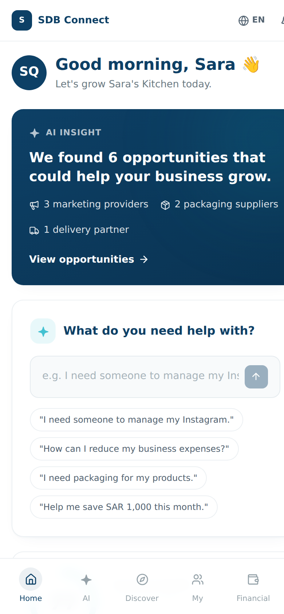
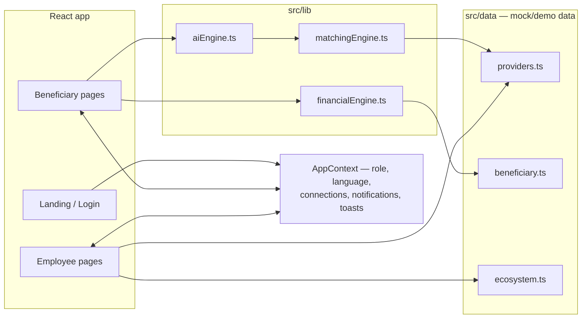

<div align="center">



<br/>

[](https://react.dev)
[](https://www.typescriptlang.org)
[](https://vite.dev)
[](https://tailwindcss.com)
[](https://www.framer.com/motion/)

[](#)
[](#privacy--demo-data)
[](#)
[](#)

**SDB doesn't just finance people. It finances an ecosystem.**

*An AI-powered beneficiary network for the Social Development Bank — turning isolated financing recipients into a working economic community.*

</div>

<br/>

## What is this

SDB finances thousands of productive families, freelancers, entrepreneurs, startups and small businesses — but the economic value between them is disconnected. A productive family running a home bakery needs branding, packaging, delivery and marketing. Other SDB beneficiaries already provide exactly those services. They just never find each other.

**SDB Connect** (وصل) is the fix: an AI layer over the existing beneficiary base that turns it into a searchable, matchable ecosystem, built around three pillars —

| | | |
|---|---|---|
| 🔗 **Connect** | AI matches beneficiaries with relevant businesses, freelancers, suppliers and partners inside the SDB ecosystem. |
| 📈 **Grow** | AI surfaces unmet needs and potential connections beneficiaries wouldn't have found on their own. |
| 🐷 **Sustain** | An AI Financial Copilot helps beneficiaries manage cash flow, cut expenses and build savings habits. |

This repo is a fully working, click-through frontend MVP for the ImpactX Hackathon (AI & Emerging Technologies track) — **no backend, no API key required.** All "AI" behavior is a deterministic mock engine (see [`src/lib/aiEngine.ts`](src/lib/aiEngine.ts)) that reads free-text input, scores real matches, and explains its reasoning — so the demo runs reliably offline, every time.

<br/>

## Contents

- [Two experiences](#two-experiences)
- [Screenshots](#screenshots)
- [Brand](#brand)
- [How the "AI" works](#how-the-ai-works)
- [Architecture](#architecture)
- [Quick start](#quick-start)
- [Project structure](#project-structure)
- [Live demo script](#live-demo-script-4–5-min)
- [Privacy & demo data](#privacy--demo-data)

<br/>

## Two experiences

<table>
<tr>
<td width="50%" valign="top">

### 🏠 Beneficiary

Sara Al-Qahtani · *Sara's Kitchen* · Productive Family · Riyadh

- Personalized dashboard with an AI insight feed
- Natural-language AI Assistant that finds & ranks real matches
- **Agentic mode** — "find me a marketing provider under SAR 2,000" triggers a step-by-step AI agent that searches, compares, and asks to connect
- Ecosystem discovery + My Network with category filters
- Financial Copilot: health score, cash-flow trend, live **budget optimizer**
- Savings goal tracker with a plan builder

</td>
<td width="50%" valign="top">

### 🏛️ SDB Employee

Ecosystem Intelligence — role-based, aggregated, privacy-first

- Ecosystem-wide KPIs (beneficiaries, active businesses, potential connections)
- **AI Opportunity Engine** — demand vs. supply by category, ranked
- Potential Ecosystem Connections — AI-detected beneficiary-to-beneficiary matches
- Interactive Ecosystem Map (click a category → needs, providers, geography)
- AI-generated insight panel, all explicitly labeled as simulated data
- **No individual financial data is ever surfaced to employees** — aggregated & anonymized by design

</td>
</tr>
</table>

<br/>

## Screenshots

<table>
<tr>
<td width="50%"><br/><sub align="center">Landing — animated ecosystem network</sub></td>
<td width="50%"><br/><sub>Beneficiary home — AI insight + quick action</sub></td>
</tr>
<tr>
<td width="50%"><br/><sub>AI Assistant — ranked matches with reasons</sub></td>
<td width="50%"><br/><sub>Financial Copilot — health score & cash flow</sub></td>
</tr>
<tr>
<td width="50%"><br/><sub>Ecosystem Intelligence — employee overview</sub></td>
<td width="50%"><br/><sub>Interactive ecosystem map</sub></td>
</tr>
</table>

<p align="center"><br/><sub>Fully responsive — own mobile navigation, not a shrunk desktop view</sub></p>

<br/>

## Brand

Backgrounds stay white — color is used with intent, not decoration.

<table>
<tr>
<td align="center"><br/><code>#0D4066</code><br/><sub>Deep Blue</sub></td>
<td align="center"><br/><code>#12B1C6</code><br/><sub>Cyan</sub></td>
<td align="center"><br/><code>#0074AE</code><br/><sub>Blue</sub></td>
<td align="center"><br/><code>#34B889</code><br/><sub>Green</sub></td>
<td align="center"><br/><code>#70154C</code><br/><sub>Burgundy</sub></td>
<td align="center"><br/><code>#F0693E</code><br/><sub>Orange</sub></td>
<td align="center"><br/><code>#97ACB6</code><br/><sub>Slate</sub></td>
<td align="center"><br/><code>#44546A</code><br/><sub>Navy</sub></td>
</tr>
</table>

Typography: **IBM Plex Sans** (Latin) paired with **Tajawal** (Arabic) — the app ships full English/Arabic support with a real RTL layout flip, not just mirrored text.

<br/>

## How the "AI" works

No API key, no network call, no flaky demo. `src/lib/aiEngine.ts` and `src/lib/matchingEngine.ts` parse free text deterministically:

```
"I need someone to manage Instagram for my bakery"
        │
        ├─ detects category   → Marketing
        ├─ detects specialty  → food & beverage (from "bakery")
        ├─ scores every provider against category + specialty + rating + budget
        └─ returns ranked matches with human-readable "why this match" reasons

"Find me a marketing provider under SAR 2,000"
        │
        ├─ same detection, plus a budget ceiling
        ├─ recognized as an agentic request ("find me…")
        └─ runs an animated multi-step agent: understand → search → compare →
           check budget → rank → recommend → "Ask AI to connect us"
```

Financial phrasing ("how can I reduce my expenses") routes to the Financial Copilot instead of provider matches. Swap `interpretQuery()` for a real LLM call later without touching any UI code — it's the single seam.

<br/>

## Architecture



<br/>

## Quick start

```bash
npm install
npm run dev
```

Open the printed local URL. To build & preview a production bundle:

```bash
npm run build
npm run preview
```

**Stack:** React 19 · TypeScript · Vite · Tailwind CSS v4 · Framer Motion · Recharts · React Router · Lucide icons — no backend required.

<br/>

## Project structure

```
src/
  types/            Shared TypeScript types
  data/              Mock demo data — providers, beneficiary profile, ecosystem stats
  lib/               aiEngine · matchingEngine · financialEngine · utils
  state/             AppContext — role, language, connections, notifications, toasts
  components/
    ui/              Design-system primitives (Button, Card, Modal, ScoreRing…)
    layout/          Sidebar, mobile nav, app shell
    ai/              AI console, match cards, agentic flow, connection modal
    charts/          Recharts wrappers (cash flow, demand/supply, wellbeing…)
    network/         Landing hero network viz + employee ecosystem map
    financial/       Interactive budget optimizer
    story/           "From Beneficiary to Ecosystem" closing visual
  pages/
    beneficiary/     Home · AI Assistant · Discover · My Network ·
                      Financial Copilot · Savings · Notifications · Provider Profile
    employee/        Overview · Ecosystem · Opportunities · AI Matches ·
                      Beneficiaries · Insights
```

<br/>

## Live demo script (4–5 min)

1. **Landing** — animated ecosystem network, the Connect / Grow / Sustain pillars.
2. **Login → Continue as Beneficiary.**
3. **Home** — the AI insight card ("We found 6 opportunities…") and financial snapshot.
4. **AI Assistant** — *"I need someone to manage Instagram for my bakery"* → ranked matches, Noor Creative at 92%, with reasons.
5. Same screen → *"Find me a marketing provider under SAR 2,000"* → watch the agentic flow → **Ask AI to connect us** → **Send connection** → success animation + 3-day follow-up reminder.
6. **Financial Copilot** — health score, "expenses increased 14%" insight, then drag sliders live in the **AI Budget Optimizer**.
7. **Savings** → **Build my plan**.
8. Switch experience → **Continue as SDB Employee.**
9. **Overview** → ecosystem-wide KPIs (marked simulated).
10. **Opportunities** → expand "Marketing" for the demand/supply gap and AI insight.
11. **AI Matches** → Sara's Kitchen → Noor Creative, 92%.
12. **Ecosystem** → click through categories on the map.
13. Close on **Insights** → "From Beneficiary to Ecosystem."

<br/>

## Privacy & demo data

All beneficiary, provider and ecosystem numbers here are fictional and labeled **Demo data** / **Simulated demo data** wherever shown — none of it represents real SDB beneficiaries or statistics. The employee experience is built privacy-first on purpose: it never surfaces an individual beneficiary's private financial data, only aggregated, anonymized ecosystem metrics and information from public business profiles.

<br/>

<div align="center">
<sub>Built for the ImpactX Hackathon — AI & Emerging Technologies track.</sub>
</div>
